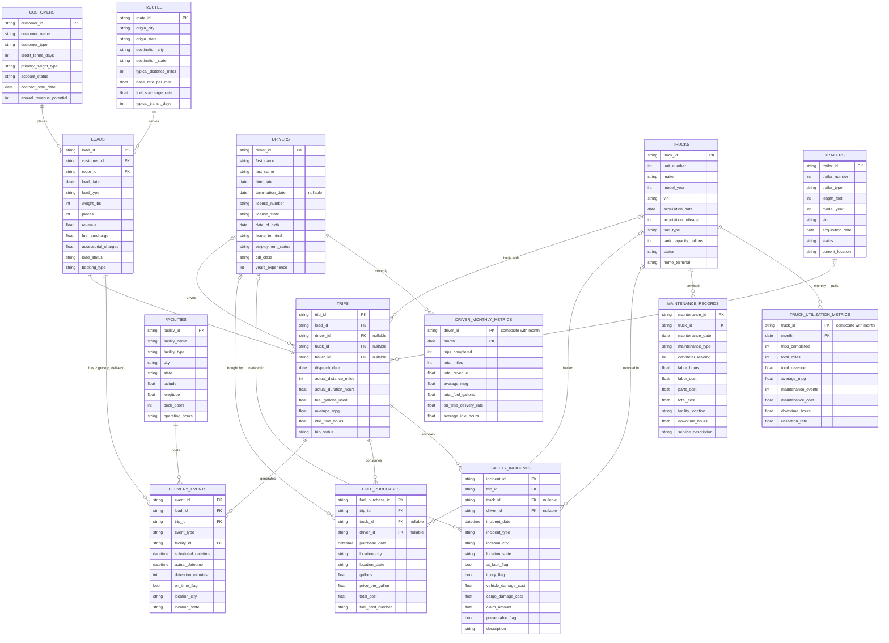

# ER-diagram

## Data Model (ER Diagram)

All foreign keys were validated against the raw CSVs: **zero orphan records** across every relationship below.

### Join notes (read before writing SQL)

- **loads : trips is 1:1.** Every load has exactly one trip, so joining them never inflates revenue.
- **delivery_events has exactly 2 rows per load** (Pickup and Delivery). Joining loads to events duplicates `revenue`. Aggregate events first, or filter to `event_type = 'Delivery'`.
- **fuel_purchases is many per trip** (up to 11), and 8,471 trips have no fuel purchase. Aggregate fuel to trip level before joining.
- **trips.driver_id, truck_id and trailer_id are nullable** (about 1,700 rows each). Use LEFT JOINs, or those trips disappear from your profit totals.
- **Monthly metric tables** (`truck_utilization_metrics`, `driver_monthly_metrics`) are pre-aggregated at truck-month and driver-month grain. Don't join them to trip-level facts, or you will double count.
